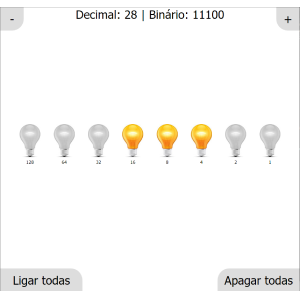

# Lâmpadas binárias

Experimento de conversão de números decimais e binários. É possivel ligar e desligar os bits para produzir números binários e também aumentar ou diminuir esses números com os controles da parte de cima.

<kbd></kbd>

https://shuantsu.github.io/binary_lamps
